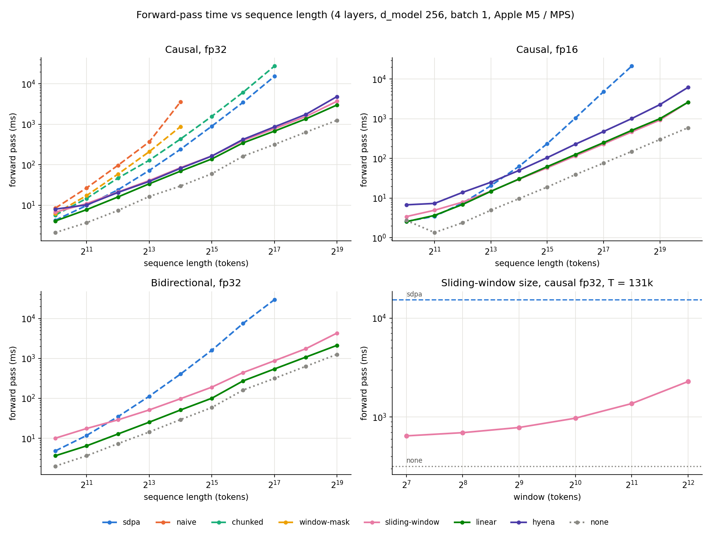

# Efficient attention for long genomic sequences

This folder collects attention variants and alternatives to attention for long DNA
sequences, a benchmark of **forward-pass time versus sequence length**, and the
findings. Everything plugs into the repo's `TransformerLayer` through `attention=`.

| File | Contents |
|---|---|
| `attention.py` | `NaiveAttention`, `WindowMaskAttention`, `ChunkedAttention`, `SlidingWindowAttention`, `LinearAttention` (all subclass `MultiHeadSelfAttention` and replace only `attend`) |
| `hyena.py` | `HyenaOperator`: gated long convolution through the FFT (the HyenaDNA mixer) |
| `model.py` | `LongDNAModel`: embedding, then N × (mixer + MLP), then logits. `MIXERS` maps each name to its module, including `none`, which has no token mixing and serves as the cost floor |
| `bench.py` | benchmark suite: doubles T until a forward pass exceeds 10 s or runs out of memory, and appends one JSON line per (mixer, T) |
| `plot.py` | log-log plot and markdown table, with the fitted scaling exponent |
| `tests/` | each variant is checked against a slow, independent reference in float64, plus causality and model-building checks |

```bash
cd dl-experiments
python3 research/tests/run_tests.py                      # 7 tests, all pass
python3 -m research.bench --out research/results/x.jsonl # add --dtype float16, --bidirectional, --window N
python3 -m research.plot research/results/x.jsonl        # writes x.png and prints the table
```

**Setup.** Apple M5 with 24 GB unified memory, running on the MPS backend with PyTorch 2.14. The MPS allocation cap is 12.4 GiB, set through the watermark ratio of 0.7 so that runs fail cleanly instead of swapping. The model has 4 layers, d_model 256, 4 heads (d_head 64), a 4× GELU MLP, LayerNorm and RoPE. Batch size is 1 and every run is under `inference_mode`. Each time is the median of 5 forward passes after 1 warm-up pass.

## Results



Per-run plots: `results/causal_fp32_v2.png`, `causal_fp16.png`, `bidir_fp32.png`, `causal_fp32_v1.png` (before the v2 fixes). Regenerate with `python3 -m research.plot --summary research/results`.

Causal, fp32, milliseconds per forward pass (`results/causal_fp32_v2.jsonl`). "—" means the run exceeded the time budget or ran out of memory. The slope is the log-log exponent over the last 3 points: 1 means linear, 2 means quadratic.

| T | sdpa | naive | chunked | window-mask | sliding-window | linear | hyena | none |
|---:|---:|---:|---:|---:|---:|---:|---:|---:|
| 1,024 | 4 | 8 | 6 | 6 | 7 | 4 | 8 | 2 |
| 4,096 | 24 | 97 | 47 | 59 | 21 | 16 | 21 | 7 |
| 16,384 | 242 | 3,606 | 434 | 880 | 85 | 70 | 82 | 30 |
| 65,536 | 3,509 | OOM | 6,204 | OOM | 398 | 349 | 425 | 164 |
| 131,072 | 15,331 | — | 27,498 | — | 783 | 680 | 865 | 319 |
| 524,288 | — | — | — | — | 3,727 | 3,013 | 4,863 | 1,257 |
| slope | 2.04 | 2.61 | 2.06 | 1.95 | 1.13 | 1.07 | 1.25 | 0.99 |

Causal fp16 (`results/causal_fp16.jsonl`, plotted in `causal_fp16.png`): all the subquadratic mixers reach **1M tokens**. At that length sliding-window takes 2.6 s, linear 2.6 s, hyena 6.2 s and the no-mixer floor 0.6 s. Dense SDPA takes 21 s at 262k tokens.

Bidirectional fp32 (`results/bidir_fp32.jsonl`) at 131k tokens: sdpa 29.6 s, sliding-window 0.88 s, linear 0.55 s, floor 0.32 s.

## Findings

1. **At 131k tokens the linear-time mixers are about 20× faster than dense attention.** Sliding-window is 19.6× faster than SDPA, linear attention 22.5× and Hyena 17.7×. All three scale with a slope near 1, and dense SDPA scales with a slope near 2. They already match SDPA at 2k tokens and beat it from 4k tokens on. In fp16 the crossover moves to 4k–8k tokens.

2. **The fused SDPA kernel is already a strong baseline.** On MPS it never stores the T×T matrix: SDPA reaches 131k tokens, while naive attention runs out of memory at 32k because its score matrix alone needs 16 GiB. With `is_causal=True` the kernel also skips the masked-out tiles, which halves the cost. In a microbenchmark at 16k tokens, SDPA took 44 ms with `is_causal`, 89 ms with no mask, and 109 ms with a bool mask, which also added 1 GiB of memory. Dense attention is therefore limited by time, not memory: 15 s at 131k tokens in fp32 for this small model.

3. **Masking and Python-level tiling do not beat the fused kernel.**
   - `window-mask` gives the same output as sliding-window through a banded mask on dense SDPA. It is 3.6× *slower* than full SDPA and runs out of memory at 32k tokens: an explicit mask turns off tile skipping and forces a T×T mask allocation.
   - `chunked`, exact attention computed one query block at a time, is 1.8× slower than SDPA for the same reason. Chunking only pays off when the kernel would otherwise store the full T×T matrix, as the naive one does.
   - The lesson: to save compute, change the *shapes* of the computation, not the mask.

4. **Once attention is linear, the rest of the model dominates.** With no mixer at all (`none`), the model takes 0.32 s at 131k tokens. The efficient mixers take 2.1–2.7× that floor, so their attention step accounts for only 53–63% of the time. A perfect mixer could gain at most about 2.5× more. The MLP and the projections become the bottleneck, and in fp32 they also set the length ceiling: even `none` runs out of memory at 1M tokens.

5. **How a variant is implemented matters as much as which one it is.** Three fixes from the second iteration (v1 is `results/causal_fp32_v1.*`):
   - **Sliding-window, 1.3–1.5× faster end to end.** Its attention step went from 256 ms to 119 ms per layer at 262k tokens after building key windows with one `unfold` copy instead of pad + pad + cat. The fix also uses one (w, 2w) band mask shared by every block, instead of a per-block mask that SDPA expanded into gigabytes. Only the edge blocks, which would otherwise attend to padding, are recomputed.
   - **Linear attention, 27% less time at 512k tokens.** Changing its chunk from 256 to 64 helped because the within-chunk scores, T·C·H floats, dominate its memory and time.
   - **Hyena, twice the fp32 length before running out of memory.** The MPS FFT's hidden workspace grows with the number of channels transformed at once: 6 GiB at 262k tokens. Transforming 16 channels at a time is slightly faster and cut that to 2.2 GiB, which moved Hyena's fp32 out-of-memory point from 512k to 1M tokens. In fp16 it now runs at 1M.

6. **Precision.** fp16 gives 2.7–3.4× over fp32 for SDPA, sliding-window and linear attention. Hyena gains only 1.8× because its FFT is kept in fp32 by design. Hyena is also the slowest linear-time mixer in fp16 (6.2 s at 1M tokens against 2.6 s), because its FFT cost grows as T log T.

7. **Bidirectional models (DNABERT-style masked LMs).** Dense SDPA costs 1.9× its causal time because there are no tiles to skip. Linear attention gets *cheaper* than causal (0.8×) because it needs no chunked prefix state. For encoder-style genomic models, linear attention is the fastest option measured.

8. **Window size (sliding-window, causal fp32, T = 131k).**

   | window | 128 | 256 | 512 | 1024 | 2048 | 4096 |
   |---|---:|---:|---:|---:|---:|---:|
   | ms | 644 | 694 | 783 | 972 | 1,367 | 2,282 |

   The cost is nearly flat up to a window of about 512 because the MLP floor dominates. The receptive field is about layers × window, which is 2k tokens for 4 layers × 512. Very long-range interactions therefore need either wide windows or a different mixer.

9. **Tokenization is the cheapest lever for genomics.** Non-overlapping k-mers (`dna.tokenizer`, `k>1`) divide T by k, so a quadratic mixer saves up to k². For 131k bases, dense SDPA takes 15.3 s at k=1, 0.90 s at k=4 (32k tokens) and 0.24 s at k=8 (16k tokens). This combines with every mixer above.

## What this does *not* show

- **Speed only, not model quality.** Sliding-window cannot see beyond about L × w tokens. Linear attention is known to trail softmax attention on recall-style tasks, and here it has no RoPE, because RoPE would break the positivity that its normaliser relies on. Hyena's quality depends on training. The next step is to train each mixer with `dna.train`, using the synthetic Markov source extended with a planted long-range dependency, and compare nats/base with forward time.
- **Only the forward pass (inference).** Training also stores activations for the backward pass, which changes the memory ceiling.
- **One backend.** On CUDA, FlashAttention-2/3 and FlexAttention (block-sparse masks that *do* skip tiles) would change finding 3. The ranking of dense against linear-time mixers should hold, but the crossover point will move.
- **Not implemented:** Mamba/Caduceus (selective state spaces, needs a scan kernel to be fast), hybrids of a few global layers with local layers, and Linformer or Performer (low-rank and random-feature approximations; Performer sits in the same family as `linear`).

## Recommendation

For long DNA on this hardware, start with **k-mer tokenization plus sliding-window attention** (exact softmax locally, keeps RoPE, fastest to adopt) or **linear attention** for bidirectional models. Add a few full-attention or Hyena layers if the task needs dependencies longer than L × w. Dense SDPA with `is_causal=True` remains the right choice up to about 4k tokens.
